# SPH-based Fluid Simulator

---

**Summary: **A generic template for a fluid particle simulator based on the Monaghan SPH (smoothed particle hydrodynamics) method is produced for the purpose of simulating fluids. Based on C++ object-oriented programming, the GLM mathematical library and OpenGL, it is possible to simulate fluids efficiently and concurrently in real time based on the set mesh and custom added materials, as well as to realize the interactive simulation of multiple fluids.

**KeyWords: ** Fluid Simulation; Fluid Interaction; Hydrodynamics;Navier-Stokes equation; Monaghan's SPH

---

## Third-party Libraries

-   glm
-   glad
-   glfw
-   stb_master

## Callable Functions

1.  **Initialize fluid and reset function**

The fluid simulation needs to provide a fluid survival interval to ensure that the fluid flows only inside the box. Since the initialization function is available, an additional reset function should be provided.

~~~c++
void init(   
    unsigned short maxPointCounts,
    const glm::vec3& wallBox_min,
    const glm::vec3& wallBox_max,
    const glm::vec3& initFluidBox_min,
    const glm::vec3& initFluidBox_max,
    const glm::vec3& gravity
);
void reset();
~~~

Where: 

-   **maxPointCounts**: Limit maximum number of particles.

-   **wallBox_min&max**: Determine a unique fluid box by the maximum and minimum coordinates of the cuboid;

-   **initFluidBox_min&max**: Generate an initial fluid block through the maximum and minimum coordinates of the cuboid;

-   **gravity**: Determine the global gravity (total external force);

2.  **Generate fluid block**

It is quite limiting to construct fluid blocks only by initializing functions, so a set of functions to generate fluids is provided.

~~~c++
bool addPoint(glm::vec3 min, glm::vec3 max, glm::vec3 originVelocity);
bool addPoint(glm::vec3 min, glm::vec3 max, glm::vec3 originVelocity, MateralIndex materalIndex);
~~~

Where: 

-   **min&max**: Generating a fluid block through the maximum and minimum coordinates of the cuboid;

-   **originVelocity**: Initialize a speed to achieve a fluid ejection effect, such as a water gun;

-   **materalIndex**: (Optional) The default is water fluid, and the material can be customized;

3.  **Tick to generate fluid block**

Add fluid in the loop.

~~~c++
bool addPointTick(glm::vec3 min, glm::vec3 max, glm::vec3 originVelocity);
bool addPointTick(glm::vec3 min, glm::vec3 max, glm::vec3 originVelocity, MateralIndex materalIndex);
~~~

Where:

-   **min&max**: Generating a fluid block through the maximum and minimum coordinates of the cuboid;

-   **originVelocity**: Initialize a speed to achieve a fluid ejection effect, such as a water gun;

-   **materalIndex**: (Optional) The default is water fluid, and the material can be customized;

4.  **Add material**

Add a material, return the index of the material.

~~~c++
MateralIndex addMateral(Materal* newMateral);
~~~

其中：

-   **newMateral**: Build a new material through `new`;

5.  **Get drawing data**

~~~c++
// Get the size of the point class (bytes)
unsigned int getPointStride()const { return sizeof(Point); }
// Get the number of points
unsigned int getPointCounts()const { return f_PointBuffer.getPointNumber(); }
// Get fluid point buffer
const Point* getPointBuf()const { return f_PointBuffer.getPoint(0); }
// Get fluid points' position buffer
GLfloat *getPosData() { return &(posData[0]); }
~~~

## Result display

1.  **Generate fluid free fall**

    ~~~c++
    fluid.addPoint(glm::vec3(-15, -10, -15), glm::vec3(10, 20, 10), glm::vec3(0, 0, 0));
    ~~~

    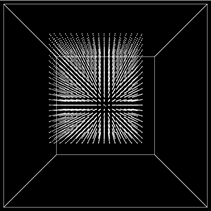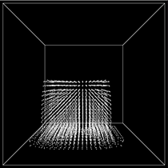 

    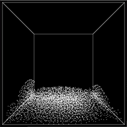 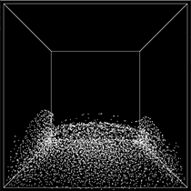

    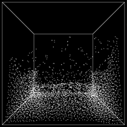 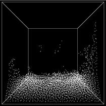

    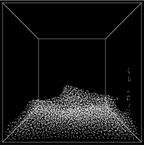 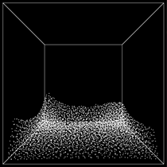

2.  **Generate a single material and two fluids to interact with each other (the second fluid of the same material adds dyeing treatment)**

    ~~~c++
    MateralIndex WaterRed = fluid.addMateral(
        new Materal(
            1.0f,  1000.f,        	// The parameters of the water
            glm::vec3(1, 0.5, 0.5)  // Color
    ));	// Red water
    fluid.addPoint(glm::vec3(-20, -20, -20), glm::vec3(0, 0, 0), glm::vec3(0, 0, 0));
    fluid.addPoint(glm::vec3(0, 0, 0), glm::vec3(20, 20, 20), glm::vec3(0, 0, 0), WaterRed);
    ~~~

    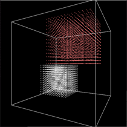 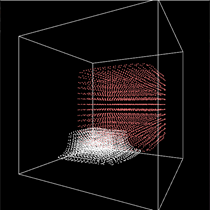

     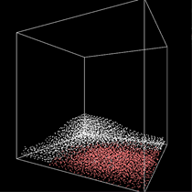

    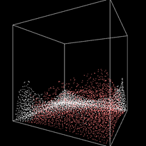 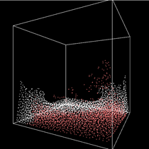

    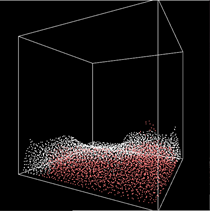 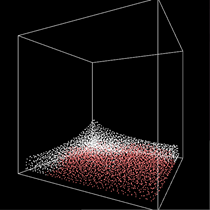

3.  **Generate dual-material dual-fluid**

    ~~~c++
    MateralIndex L_Water = fluid.addMateral(
        new Materal(
            1.0f,
            200.f,
            glm::vec3(1, 0.5, 0.5)
        )
    );
    fluid.addPoint(glm::vec3(-20, -20, -10), glm::vec3(0, 0, 0), glm::vec3(0, 0, 0), L_Water);
    fluid.addPoint(glm::vec3(-20, -20, -20), glm::vec3(0, 0, -10), glm::vec3(0, 0, 0));
    fluid.addPoint(glm::vec3(-20, -20, 0), glm::vec3(0, 0, 20), glm::vec3(0, 0, 0));
    ~~~

    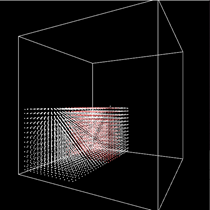 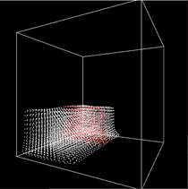

    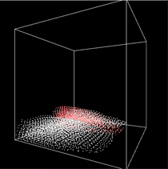 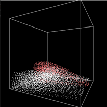

    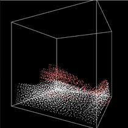 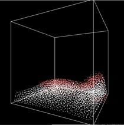

4.  **More ...**

    ~~~c++
    MateralIndex H_Oil = fluid.addMateral(
        new Materal(
            30.0f,
            5000.f,
            glm::vec3(0.5, 0.5, 1)  // blue
        )
    );
    MateralIndex L_Oil = fluid.addMateral(
        new Materal(
            30.0f,
            200.f,
            glm::vec3(0.5, 1, 0.5)  // Green
        )
    );
    MateralIndex L_Water = fluid.addMateral(
        new Materal(
            1.0f,
            200.f,
            glm::vec3(1, 0.5, 0.5)  // Red
        )
    );
    fluid.addPoint(glm::vec3(-20, -20, 0), glm::vec3(0, 0, 10), glm::vec3(0, 0, 0), L_Oil);
    fluid.addPoint(glm::vec3(-20, -20, -20), glm::vec3(0, 0, -10), glm::vec3(0, 0, 0), L_Water);
    fluid.addPoint(glm::vec3(0, 0, 0), glm::vec3(20, 20, 20), glm::vec3(0, 0, 0), H_Oil);
    ~~~

    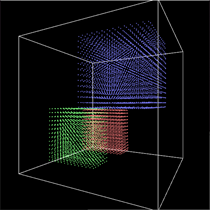 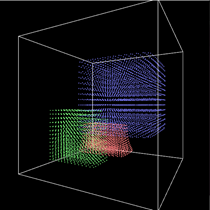

    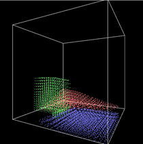 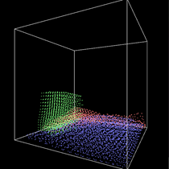

    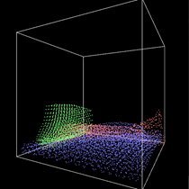 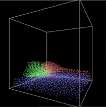

5.  **Generates jet fluid**

    ~~~c++
    while (!glfwWindowShouldClose(window)) {
    	fluid.addPointTick(glm::vec3(-20, -4, -4), glm::vec3(-20, 0, 0), glm::vec3(2, 0, 0));
    	...
    }
    ~~~
    
    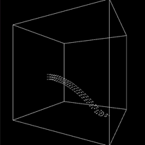 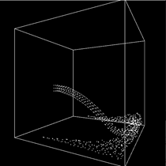
    
    ~~~c++
    while (!glfwWindowShouldClose(window)) {
    	fluid.addPointTick(glm::vec3(-20, -4, -4), glm::vec3(-20, 0, 0), glm::vec3(3, 0, 0));
    	...
    }
    ~~~
    
    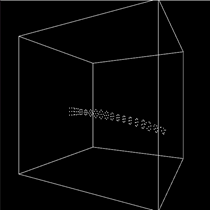 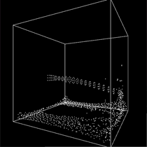

    ~~~c++
    while (!glfwWindowShouldClose(window)) {
        fluid.addPointTick(glm::vec3(-20, -4, 4), glm::vec3(-20, 0, 8), glm::vec3(2, 0, 0), L_Water);
        fluid.addPointTick(glm::vec3(-20, -4, -8), glm::vec3(-20, 0, -4), glm::vec3(2, 0, 0), L_Oil);
        fluid.addPointTick(glm::vec3(-20, 4, -4), glm::vec3(-20, 8, 0), glm::vec3(2, 0, 0), H_Oil);
        fluid.addPointTick(glm::vec3(-20, -4, -4), glm::vec3(-20, 0, 0), glm::vec3(2, 0, 0));
        ...
    }

 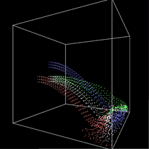
    
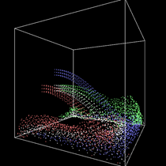 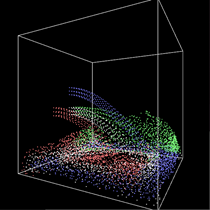

