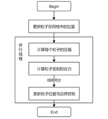
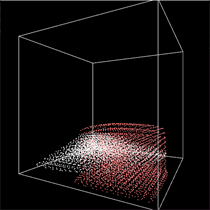

# 基于SPH的流体模拟器

---

**摘 要：** 围绕模拟流体的目的，制作出了基于Monaghan SPH（smoothed particle hydrodynamics，光滑粒子流体动力学）方法的流体粒子模拟器通用模板。基于C++面向对象编程、GLM数学库和OpenGL，实现了一个简单的流体粒子系统，可以根据设置的网格参数和自定义添加的材质参数，高效并发实时模拟流体的形态变化，同时实现多种流体的交互模拟。

**关键词：** 流体模拟；流体交互；流体动力学；Navier-Stokes方程；SPH；OpenGL；GLM

---

# 介绍

## 流体模拟简介

伴随着计算机的发展，人们的生活对于计算机的这类工具也越发依赖。与此同时，伴随计算机一同增加的是工程计算、军事仿真、游戏和电影等领域对真实物理环境模拟的需求。如何提高计算机模拟仿真物理现象的真实性、准确性和效率成了科学家们关注的问题，也成了计算机图形学这一学科发展突破的方向。

流体模拟是计算机物理仿真的一个重要仿真内容，它的主要目的是实现真实高效的流体模拟。在对真实世界的模拟中，流体模拟是最重要也最常用的领域之一。从水流流动到喷射倾倒，甚至是卷动的龙卷风，计算机模拟的水、火焰、气流等的流体得到了广泛的使用。而流体动力学是一个复杂的领域，流体模拟也以计算量巨大而著称，但是一旦它出了效果就能提供巨大的产品价值以及叹为观止的视觉效果。

常见的流体模拟方法有三种：

1.  基于纹理变化的流体模拟；

2.  基于二维高度场网格的流体模拟；

3.  基于真实物理方程的流体解算；

而基于真实物理方程的流体模拟是其三个基本方法中的一种，也是现在图形学发展的一个方向，其核心也就是流体方程(Navier-Stokes方程, 也称N-S方程)：

$$
\rho\left( \overrightarrow{r_{i}} \right)\frac{\text{dV}}{\text{dt}} = \rho\left( \overrightarrow{r_{i}} \right)\overrightarrow{g} - \nabla p(\overrightarrow{r_{i}}) + \mu\nabla^{2}\overrightarrow{v}(\overrightarrow{r_{i}})
$$

若完全用它来进行模拟，这必然是一个不可能完成的计算量，所以伴随延伸的就是一系列用于近似模拟的算法与模型。其中最常用，也是最逼真的一类算法就是本作品实现的SPH方法。

## SPH方法简介

光滑粒子流体动力学(smoothed particle hydrodynamics, SPH)方法是流体模拟的一种常用方法，也是当前用于基于物理的流体仿真无网格法的主要方法。如何利用SPH方法进行更好地自由流体的表面模拟也是当今一大热点课题。

1994年，Monaghan首次实现了基于SPH的自由表面流体模拟^\[3\]^，该结果为后人的基于SPH方法的自由表面流体模拟的研究奠定了基础。伴随技术的发展，SPH延伸出了多种算法模型，例如用于解决由邻域粒子缺失导致的负压力从而产生的非物理聚集现象的Ghost SPH^\[4\]^方法，基于使用了平均曲率的表面张力模型的Yang^\[5\]^方法等。它们的存在为各种各样的领域的流体模拟的实现贡献了不可忽视的力量。

SPH方法中，对光滑核函数(Smoothing Kernel Function)的使用也是该方法的一个特点。

光滑核函数，也可被称为光滑函数(Smoothing Function)、光滑核(Smoothing Kernel)或核(Kernel)。不同的光滑核函数决定了函数的近似式和核近似与粒子近似的一致性和精度，定义了粒子的支持域$\Omega$的大小。

# 程序设计

## 类图设计

最终目的是，仅通过创建一个流体类，通过初始化、添加粒子、更新粒子和获取粒子缓冲实现简易的函数调用，设计类图如下：

其中：

-   PointBuffer：粒子缓冲类，负责对粒子存储、索引和管理；

-   Grid：网格类，负责网格的管理，用于存储粒子的哈希索引和管理空间网格的坐标；

-   NeighborTable：邻接表类，用于存储上次粒子访问的在该粒子的光滑核函数半径内的粒子的索引的链表；

-   Materal：材质类，用于管理默认的材质与自定义材质；

## 主要函数的流程图设计

1.  **粒子按帧更新函数**

2.  **更新粒子密度函数**

3.  **更新粒子受力函数**

4.  **更新粒子位移函数**

## 流体类行为描述

1.  **初始化流体与重置设置**

流体模拟需要提供一个流体的生存区间，即流体盒，保证流体只在盒内流动。既然有了初始化，就要额外提供一个重置函数，方便内存回收。

~~~c++
void init(   
    unsigned short maxPointCounts,
    const glm::vec3& wallBox_min,
    const glm::vec3& wallBox_max,
    const glm::vec3& initFluidBox_min,
    const glm::vec3& initFluidBox_max,
    const glm::vec3& gravity
);
void reset();
~~~

其中：

-   **maxPointCounts**：规范最大粒子数；

-   **wallBox_min&max**：通过长方体的最大值坐标和最小值坐标确定一个唯一的流体盒；

-   **initFluidBox_min&max**：通过长方体的最大值坐标和最小值坐标构造一个初始的流体块；

-   **gravity**：确定全局重力（合外力）；

2.  **构造流体块**

仅通过初始化函数构造流体块是十分有局限的，这将大大降低了流体系统的自由度，因此，额外提供一组自由构造的行为接口给用户进行调用。

~~~c++
bool addPoint(glm::vec3 min, glm::vec3 max, glm::vec3 originVelocity);
bool addPoint(glm::vec3 min, glm::vec3 max, glm::vec3 originVelocity, MateralIndex materalIndex);
~~~

其中：

-   **min&max**：通过长方体的最大值坐标和最小值坐标构造一个初始的流体块；

-   **originVelocity**：初始化一个速度，可实现类似水枪射水的流体射出效果；

-   **materalIndex**：（可选）默认为水流体，可自定义材质；

3.  **滴答计数式构造流体块**

但若只有构造流体行为接口，用户若想实现基于时间的"喷泉"流体，依然需要编写较多的判断代码。本模板提供了一个滴答计数的构造方法，写入循环中可实现基于滴答计数构造流体，并通过初速度计算滴答数，保证流体块的连续性，采用浮点设计，确保大速度小出口下的流体有喷射飞溅效果。

~~~c++
bool addPointTick(glm::vec3 min, glm::vec3 max, glm::vec3 originVelocity);
bool addPointTick(glm::vec3 min, glm::vec3 max, glm::vec3 originVelocity, MateralIndex materalIndex);
~~~

其中：

-   **min&max**：通过长方体的最大值坐标和最小值坐标构造一个初始的流体块；

-   **originVelocity**：初始化一个速度，可实现类似水枪射水的流体射出效果；

-   **materalIndex**：（可选）默认为水流体，可自定义材质；

4.  **添加材质**

既然提供了自定义流体材质，自然需要提供添加材质的接口，方便用户调用，简化调用的复杂度，为用户体验保驾护航。

~~~c++
MateralIndex addMateral(Materal* newMateral);
~~~

其中：

-   **newMateral**：通过new直接传入构建的新材质；

5.  **获得绘制数据**

调用流体模板的用户存在自定义绘制方法和绘制场等的需求，因此要提供可供用户使用的顶点数据和相关信息，让用户可以快速得到数据。

~~~c++
//获取点的尺寸（字节）
unsigned int getPointStride()const { return sizeof(Point); }
//获取点的数量
unsigned int getPointCounts()const { return f_PointBuffer.getPointNumber(); }
//获取流体点缓存
const Point* getPointBuf()const { return f_PointBuffer.getPoint(0); }
//获得流体点的位置缓存
GLfloat *getPosData() { return &(posData[0]); }
~~~

## 程序结果

1.  **构造流体自由下落**

    ~~~c++
    fluid.addPoint(glm::vec3(-15, -10, -15), glm::vec3(10, 20, 10), glm::vec3(0, 0, 0));
    ~~~

     

     

     

     

2.  **构造单材质双流体相互交互（第二同材质流体添加染色处理）**

    ~~~c++
    MateralIndex WaterRed = fluid.addMateral(
        new Materal(
            1.0f,  1000.f,        	//水的参数
            glm::vec3(1, 0.5, 0.5)  //颜色
    ));	// 红色的水
    fluid.addPoint(glm::vec3(-20, -20, -20), glm::vec3(0, 0, 0), glm::vec3(0, 0, 0));
    fluid.addPoint(glm::vec3(0, 0, 0), glm::vec3(20, 20, 20), glm::vec3(0, 0, 0), WaterRed);
    ~~~

     

     

     

     

3.  **构造双材质双流体交互**

    ~~~c++
    MateralIndex L_Water = fluid.addMateral(
        new Materal(
            1.0f,
            200.f,
            glm::vec3(1, 0.5, 0.5)
        )
    );// 轻水，比水更轻，粘度相同，设为红色
    fluid.addPoint(glm::vec3(-20, -20, -10), glm::vec3(0, 0, 0), glm::vec3(0, 0, 0), L_Water);
    fluid.addPoint(glm::vec3(-20, -20, -20), glm::vec3(0, 0, -10), glm::vec3(0, 0, 0));
    fluid.addPoint(glm::vec3(-20, -20, 0), glm::vec3(0, 0, 20), glm::vec3(0, 0, 0));
    ~~~

     

     

     

4.  **构造多材质多流体交互**

    ~~~c++
    MateralIndex H_Oil = fluid.addMateral(
        new Materal(
            30.0f,
            5000.f,
            glm::vec3(0.5, 0.5, 1)  //蓝色
        )
    );// 重油，比水更重，粘度更大，在标准大气压下，相对而言比水不稳定
    MateralIndex L_Oil = fluid.addMateral(
        new Materal(
            30.0f,
            200.f,
            glm::vec3(0.5, 1, 0.5)  //绿色
        )
    );// 轻油，比水更轻，粘度更大，在标准大气压下，相对而言比水更稳定
    MateralIndex L_Water = fluid.addMateral(
        new Materal(
            1.0f,
            200.f,
            glm::vec3(1, 0.5, 0.5)  //红色
        )
    );// 轻水，比水更轻，粘度相同，在标准大气压下，相对而言比水更稳定
    fluid.addPoint(glm::vec3(-20, -20, 0), glm::vec3(0, 0, 10), glm::vec3(0, 0, 0), L_Oil);
    fluid.addPoint(glm::vec3(-20, -20, -20), glm::vec3(0, 0, -10), glm::vec3(0, 0, 0), L_Water);
    fluid.addPoint(glm::vec3(0, 0, 0), glm::vec3(20, 20, 20), glm::vec3(0, 0, 0), H_Oil);
    ~~~

     

     

     

5.  **构造喷射流体**

    ~~~c++
    while (!glfwWindowShouldClose(window))
    {
    	fluid.addPointTick(glm::vec3(-20, -4, -4), glm::vec3(-20, 0, 0), glm::vec3(2, 0, 0));
    	…
    }
    ~~~

     

    ~~~c++
    while (!glfwWindowShouldClose(window))
    {
    	fluid.addPointTick(glm::vec3(-20, -4, -4), glm::vec3(-20, 0, 0), glm::vec3(3, 0, 0));
    	…
    }
    ~~~

     

    ~~~c++
    while (!glfwWindowShouldClose(window))
    {
        fluid.addPointTick(glm::vec3(-20, -4, 4), glm::vec3(-20, 0, 8), glm::vec3(2, 0, 0), L_Water);
        fluid.addPointTick(glm::vec3(-20, -4, -8), glm::vec3(-20, 0, -4), glm::vec3(2, 0, 0), L_Oil);
        fluid.addPointTick(glm::vec3(-20, 4, -4), glm::vec3(-20, 8, 0), glm::vec3(2, 0, 0), H_Oil);
        fluid.addPointTick(glm::vec3(-20, -4, -4), glm::vec3(-20, 0, 0), glm::vec3(2, 0, 0));
    }
~~~
    
 
    
     

# \[参考文献\]

1.  程志宇,徐国庆,张岚斌,等.SPH真实感流体交互模拟改进算法\[J\].武汉工程大学学报,2019,41(3): 303-306.

2.  袁志勇,徐标,廖祥云 基于SPH方法的快速逼真流体表面张力仿真\[J\].武汉大学计算机学院,中国科学院深圳先进技术研究院,2019,42(9),2062-2075.

3.  MONAGHAN J J.Simulating free surfaceflows with SPH\[J\]. Journal of Computationa Physicsl，1994,110(2):399-406.

4.  SCHECHTER H,BRIDSON R.Ghost SPH for animatingwater\[J\]. ACM Transactions on Graphics, 2012,31(4):Article No.61.

5.  Yang M,Li X,Liu Y,et a1.A novel surface tension formulation for SPH fluid simulation\[J\]. Visual Computer International Journal of Computer Graphics，2017，33(5)：1-10.